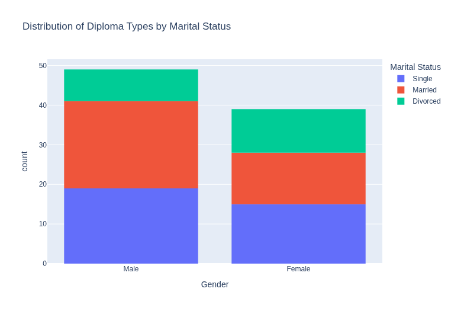
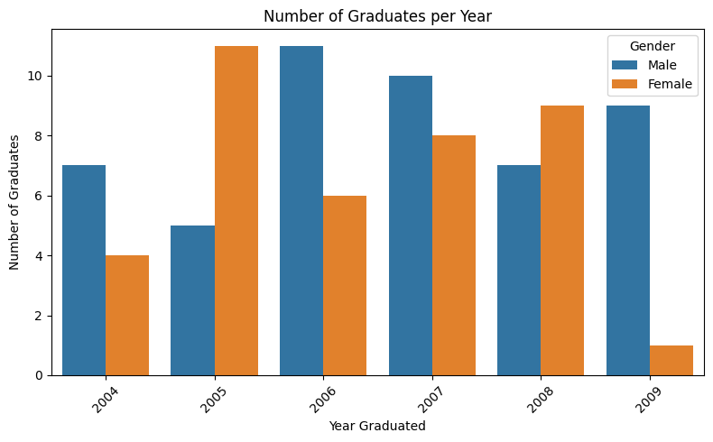

# Alumni-Analysis
Your task is to analyze the alumni dataset using Pandas to extract insights, perform data cleaning, and generate summary statistics, with specific tasks including filtering and sorting.

## Objective 
- To analyze the alumni dataset using Pandas to extract insights, perform data cleaning, and generate summary statistics

## Summary 
The data suggest that more `Males` will purse College Diploma, while only a faction of `females` will purse a College Diploma. However `females` have been showing a slight decrease in `Number of Gradutes per Year` suggest that females have taken a different and got married and have had kids. 

## Key Visualization 

### Visualization 1:
Of the `College Prep Diploma`, we can see `Males` earn an a College Diploma, less than females. The funnel connecting Standard Diploma to College Diploma for `Females` is very narrow than the Males, suggesting that more `Males` will purse `College Diploma`.

### Visualization 2:
From this histogram, the data suggest that males have a bigger `Maritual Status` with `Males`being double the size of female and single count. However, `Females` have a higher `divorced` count.

### Visualization 3:
This is a bar chart that shows the number of Graduates per year. As you can see, it hit the highest graduates in `2007` then gradualy declines from there.

Based off the data, both `Male` and `Female` have at least one drop in graduates, for `Males` its in `2007` and for `Females` it in `2009`

## Model
Using 3 of the columns from the alumni dataset and using 5 models to test the data. Result below:

| Model                  | Score |
| ---------------------- | ----- |
| LinearRegression       | -0.22 |
| RandomForestRegressor  | 0.07  |
| KNeighborsClassifier   | 0.40  |
| LogisticRegression     | 0.31  |
| RandomForestClassifier | 0.27  |

As you can see the scores aren't that great. I do plan to improve the models. For now, KNeighboros Classification did the best out of the 5 models. 

